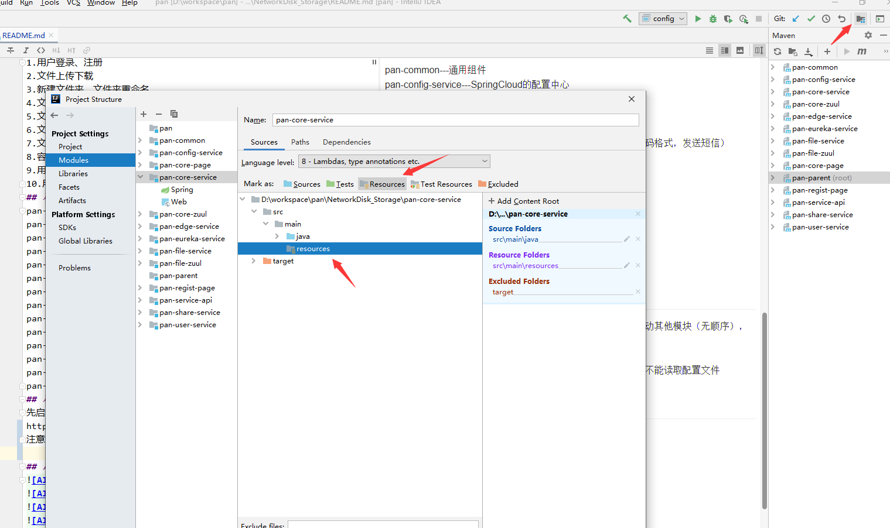
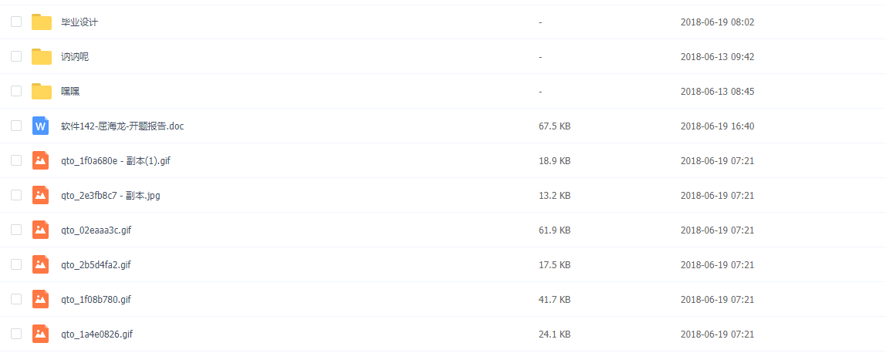
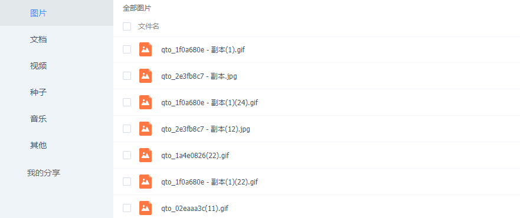
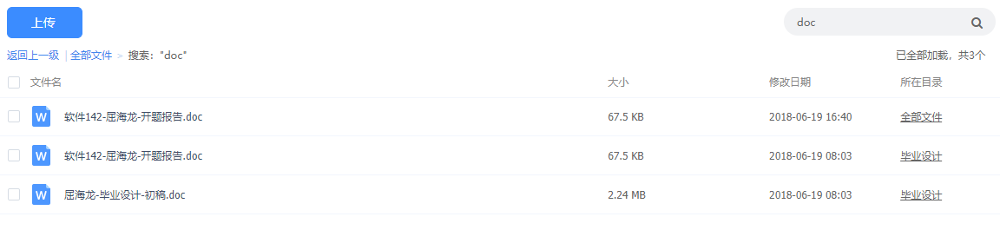
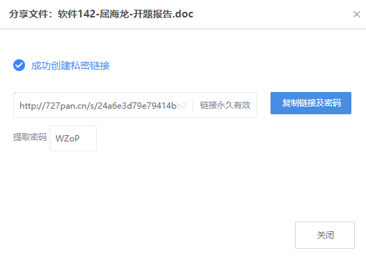
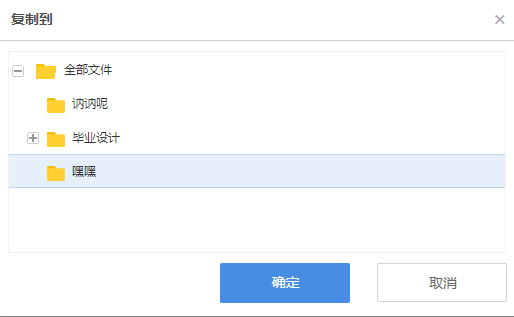
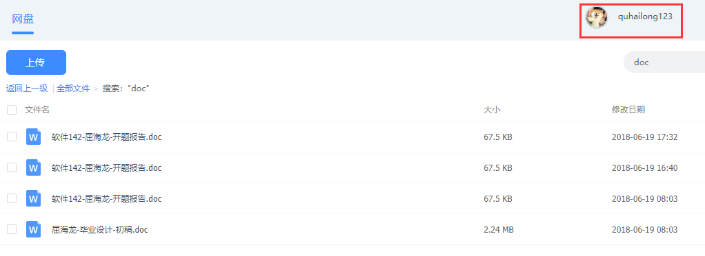

# NetworkDisk_Storage
---
## 郑重声明！！！
因本人在B站看到有人将此毕业设计进行售卖，因此作出如下声明：  
此系统为本人2018年的毕业设计，属于原创，本人允许开发者进行二次开发及传播，仅用于学习用途，不允许进行售卖，否则将追究受益人责任，请遵循GPL-v3.0协议，如需要商业用途，请联系作者   
特此声明！
## 描述
基于SpringBoot和SpringCloud的网盘系统，与百度网盘相似
## 采用技术
本项目采用的SpringBoot和SpringCloud为最新版本（SpringBoot2.3.12.RELEASE和SpringCloud Hoxton.SR12）  
数据加密采用JWT技术  
持久层框架采用Mybatis  
数据连接池采用druid  
数据库采用MySQL  
分布式缓存采用redis集群  
文件存储服务器采用FastDFS集群  
短信发送平台采用云之讯  
项目总体使用MAVEN进行构建
## 主要功能
1.用户登录、注册  
2.文件上传下载  
3.新建文件夹、文件夹重命名  
4.文件及文件夹的删除、复制、移动  
5.文件分类展示  
6.文件模糊搜索  
7.文件公开或加密分享  
8.容量展示  
9.用户头像上传  
10.用户修改密码及忘记密码  
## 项目模块划分
pan-common---通用组件   
pan-core-page---系统核心页面  
pan-core-service---系统核心服务  
pan-core-gateway---系统核心服务网关  
pan-edge-service---边缘系统（处理验证码，生成公钥，校验密码格式，发送短信）   
pan-file-service---系统文件服务  
pan-file-gateway---系统文件服务网关  
pan-parent---MAVEN项目的总jar包管理  
pan-service-api---系统微服务调用api管理  
pan-regist-page---系统注册页面的展示服务  
pan-share-service---文件分享服务  
pan-user-service---系统用户服务  
pan-framework---框架组件抽取  
## 项目运行顺序
1. 先在windows或linux平台安装nacos2.0.3，导入nacos_config.zip（nacos具体使用请百度）
2. 将项目resources目录下bootstrap.yml文件中的nacos服务地址账号密码改成自己的。
3. 将pan.sql导入到你的数据库中
4. pan-parent、pan-common和pan-framework需要install（按照顺序），之后启动其他模块（无顺序）  
5. 短信参数配置在nacos配置user-service里（云之讯平台）
http://localhost:8097/为主界面，数据库sql脚本和nacos配置均在工程根目录。  
系统默认账户名：quhailong，密码123456
>注意：每个项目中的resources文件夹需要IDEA识别出来，否则不能读取配置文件  

## 系统部分截图
  
  
  
  
  
  
  

## tips
项目有些地方还不太完善，如果有什么问题请联系  
QQ：961584293  
WX: ququhailong  
邮箱:qhl961584293@163.com  
如果觉得还行，就请点个赞把
